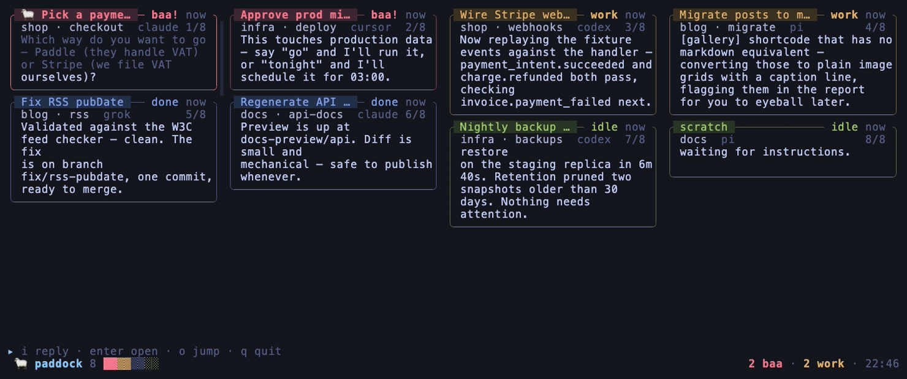
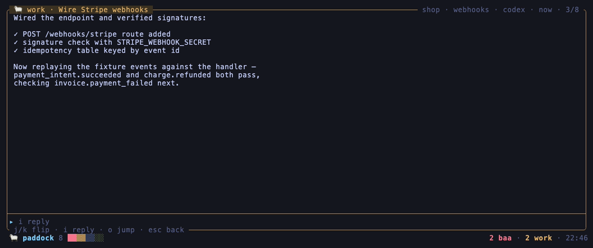
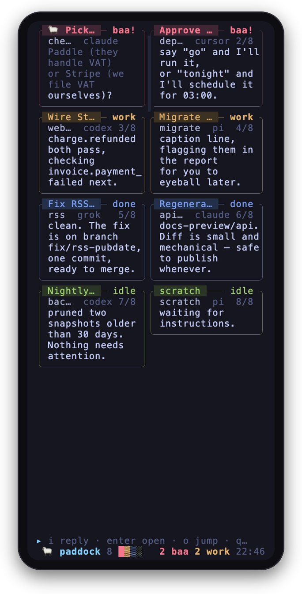

# 🐑 paddock

[](https://github.com/neyham/herdr-paddock/actions/workflows/ci.yml)
[](LICENSE)

**A card-wall feed for your herd.** Paddock turns your [herdr](https://herdr.dev)
agents into a xiaohongshu-style waterfall of cards — glance over everyone,
zoom into one, reply — over plain SSH, from a 40-column phone terminal or a
full desktop one.



Every card is one agent. Blocked agents bleat (baa!) in red at the top of
the feed, working ones follow, done and idle sink to the bottom. What you read on
a card is the agent's actual output — its own input boxes, token meters, and
keybinding bars are cleaned away.

## Why

Every remote surface for herdr is a control panel: a list of agent names,
a status dot, some buttons. Paddock is a **feed**. You know what every sheep
is saying without opening anything, and the ones waiting on you can't be
missed. Tap one, read the full transcript, type an answer, flip to the next.

- **Content first** — cleaned agent output on the card, blocked questions
  highlighted, variable-height waterfall like a real feed
- **Phone-honest** — tap targets locked at press time (no mis-taps while the
  wall refreshes), swipe-safe click detection, responsive from 40 columns up
- **Zero new trust surface** — no relay, no tunnel, no web server; SSH in
  and run it, same as herdr itself
- **Cheap on the herd** — incremental pane reads via herdr revisions; a
  20-agent wall stays light
- **A little woolly** — blocked cards breathe, the flock health bar sits in
  the status line, a 🐑 hops onto whatever you select

## Screenshots

Zoomed into one agent (enter or tap a card):



On a phone over SSH (Termux, JuiceSSH, Blink — anything with a terminal):

<p align="center">
  
</p>

## Install

Standalone (recommended — run it anywhere you can SSH from):

```sh
go install github.com/neyham/herdr-paddock/cmd/paddock@latest
paddock
```

Or as a herdr plugin (opens as a popup over your herdr session):

```sh
herdr plugin install neyham/herdr-paddock
```

Requires herdr ≥ 0.7.4 running on the same machine, and Go ≥ 1.24 to build.

### Try it without herdr

The repo ships a mock herdr with a small demo flock — the same one the
screenshots use:

```sh
git clone https://github.com/neyham/herdr-paddock && cd herdr-paddock
go build -o paddock ./cmd/paddock
HERDR_BIN_PATH="$PWD/demo/mock-herdr" ./paddock
```

## Using it inside herdr

Installing registers one action, `neyham.paddock.open`. Trigger it from
herdr's plugin action menu, from the CLI, or bind a key:

```sh
herdr plugin action invoke neyham.paddock.open
```

For a key, add to your `~/.config/herdr/config.toml` (herdr never binds keys
on a plugin's behalf — pick any free key you like):

```toml
[[keys.command]]
key = "prefix+m"
type = "plugin_action"
command = "neyham.paddock.open"
description = "paddock: open the wall"
```

Then `herdr server reload-config`. Press your prefix (default `ctrl+b`) then
`m`, and the wall pops up over your session — 92% of the screen, every agent
on cards. `q` closes it and drops you back where you were.

## Using it from a phone

SSH into the machine running herdr and run `paddock`. The layout is
responsive from 40 columns up: a compact grid on a phone, more columns as
the terminal widens. Taps work like a feed — touch a card to zoom in, swipe
to scroll (paddock locks the tap target at press time, so a wall refresh
mid-tap never opens the wrong card). In the zoomed view, flip between posts
with `j`/`k`, and the reply box is one tap away.

## Keys

| Wall | |
| --- | --- |
| `↑↓←→` / `hjkl` | move like a newspaper: up/down walk the column, then continue into the next |
| `enter` / tap | zoom into the card |
| `i` / `/` | quick reply from the wall |
| `o` | jump to the tab in herdr |
| `g` / `G` / `r` / `q` / `?` | top / bottom / refresh / quit / help |

| Zoomed | |
| --- | --- |
| `j k` / `←→` | flip to the next / previous post |
| `i` / `enter` | reply · `enter` sends, `esc` back to reading |
| `↑↓` | scroll the transcript |
| `ctrl+o` | jump to the tab in herdr |
| `esc` | back to the wall |

## How the cleaning works

Agent CLIs (pi, claude code, codex, cursor, grok, opencode, gemini…) draw
their own input box and status bars at the bottom of the pane. Paddock cuts
everything below the last border/rule line in the pane tail, then peels
remaining hint rows — so cards show what the agent *said*, not its chrome.
The heuristics are tested against fixtures shaped like each agent's real
pane tail; if your agent's footer leaks through, open an issue with the pane
tail text and it's an easy fix.

Everything that arrives from a pane is also scrubbed of terminal escape
sequences (CSI/OSC/DCS and stray control bytes) before it can reach your
TTY, so an agent that read a hostile web page can't inject clipboard writes
or cursor tricks into your SSH session.

## Notes

- Colors assume a dark terminal (Tokyo Night palette) and a truecolor
  `$TERM`; paddock respects `NO_COLOR`.
- Card titles parse the `<date>｜<task>｜<subtask>` convention some herdr
  setups use in terminal titles, and fall back to tab labels otherwise.
- `HERDR_BIN_PATH` overrides which herdr binary paddock talks to (set
  automatically when running as a plugin; also how the demo works).
- Screenshots are generated with [vhs](https://github.com/charmbracelet/vhs)
  from `demo/*.tape` against the mock herdr — `vhs demo/desktop.tape` to
  regenerate.
- `paddock` was previously called `neyham`, which is now just the author.

## License

[MIT](LICENSE)
